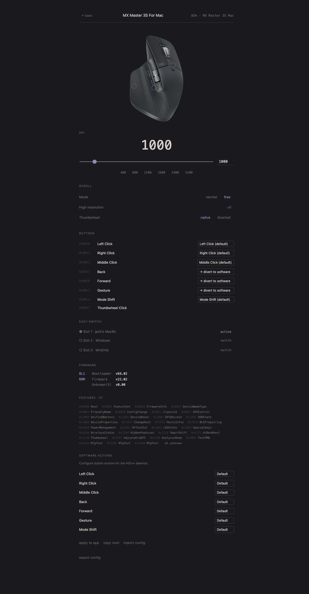

# HID++

Configure Logitech devices without Logitech Options+. Open source, runs on macOS, Linux, and Windows.

Supports 170+ Logitech devices over Bluetooth LE and USB receivers (Bolt, Unifying, Lightspeed).

<p align="center">
  
</p>

## Install

### Homebrew (macOS)

```
brew install jlevere/tap/hidpp
brew services start hidpp
```

Grant **Input Monitoring** and **Accessibility** in System Settings → Privacy & Security.

### Manual (macOS)

Download the DMG from [Releases](https://github.com/jlevere/hidpp/releases), drag HID++ to Applications, then:

```
xattr -cr /Applications/HID++.app
```

### Linux / Windows

Download from [Releases](https://github.com/jlevere/hidpp/releases). Linux users: install `udev/99-hidpp.rules` for non-root HID access.

## Config

Edit `~/.config/hidpp/config.toml` (created on first launch):

```toml
[buttons]
83 = "alt+left"       # Back → browser back
86 = "alt+right"      # Forward → browser forward

[gestures.195]        # Gesture button (thumb)
up = "ctrl+up"        # Swipe up → Mission Control
down = "ctrl+down"    # Swipe down → App Exposé
left = "ctrl+left"    # Swipe left → prev desktop
right = "ctrl+right"  # Swipe right → next desktop
tap = "playpause"     # Quick tap → play/pause
```

## Web

Configure DPI, scroll mode, button remaps, and Easy-Switch hosts from the browser. No install required.

https://jlevere.github.io/hidpp/

Works in Chrome and Edge (WebHID). Demo mode works in any browser.

## CLI

```
hidpp info
hidpp get battery
hidpp set dpi 1600
hidpp export
```

## Building

```
brew install jlevere/tap/hidpp          # from tap
nix build .#dmg                          # Nix DMG
cargo build --workspace --exclude hidpp-web  # cargo
```

Linux build deps: `libudev-dev`, `libxkbcommon-dev`, `libglib2.0-dev`, `libgtk-3-dev`, `libxdo-dev`.

## License

MIT or Apache-2.0.
